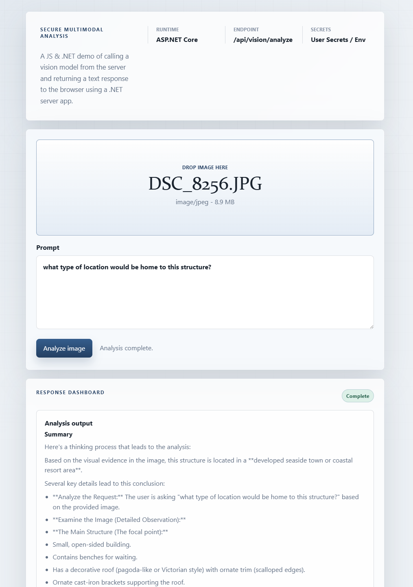

# Secure AI Vision Integration (C#)

This repository demonstrates the secure integration of a multimodal AI vision model (e.g., Gemini 1.5 Pro, GPT-4o) into a C# application. It is specifically designed with architectural best practices that allow it to be easily securely plugged into an autonomous coding agent harness (like `loop-design-build`) or standard CI/CD pipeline.



## 🎯 Key Objectives

1. **Secure by Default:** Avoids hardcoding any API strings or secrets. Credentials are systematically extracted from environment variables (mapping cleanly to CI/CD Vaults/Secrets).
2. **Dependency Injection Ready:** The `IVisionAgent` interface and `HttpClient` usage are structured to directly plug into standard .NET Core DI containers.
3. **Agentic Harness Friendly:** The code architecture is decoupled, allowing an orchestration agent to abstract the AI interactions and run unit tests deterministically.

## ⚙️ Configuration

The application uses the standard .NET configuration provider, which loads settings from multiple sources in the following priority (last one wins):

1. **`appsettings.json`**: Base settings for the endpoint and model.
2. **User Secrets**: Best for local development API keys.
3. **Environment Variables**: Best for CI/CD and production.

### Available Settings

| Key | Description | Default / Example |
| :--- | :--- | :--- |
| `AI_VISION_API_KEY` | Your AI provider API Key. | `(Required for real inference)` |
| `AI_VISION_ENDPOINT` | The REST API endpoint for the vision model. | `https://api.example.com/v1/...` |
| `AI_VISION_MODEL` | The specific model string to use. | `vision-model-v1` |
| `AI_VISION_USE_MOCK` | Forces deterministic mock responses for demos/tests. | `true` / `false` |

---

## 🚀 Getting Started

### Prerequisites
- [.NET 8.0 SDK](https://dotnet.microsoft.com/download)

### Step 1: Configure your API Key (Local Development)

The easiest way to set your API key locally without touching files is using **User Secrets**:

```bash
cd CSharpVisionAI
dotnet user-secrets init
dotnet user-secrets set "AI_VISION_API_KEY" "your-actual-api-key"
```

### Step 2: Run the Web Demo

```bash
# Start the web server
dotnet run
```

> [!NOTE]
> If `AI_VISION_API_KEY` is omitted, the demo will automatically inject a dummy key and use a **mock response** to ensure the UI remains testable without a real provider.

Once started, open your browser and navigate to **`http://localhost:5000`**. You can drag-and-drop an image and submit a prompt to see the secure vision analysis in action.

### Running Tests

The solution includes a dedicated test harness to verify the API boundary and project logic:

```bash
cd CSharpVisionAI.Tests
dotnet run
```

## 🏗️ Architecture

```csharp
public interface IVisionAgent
{
    Task<string> AnalyzeImageAsync(string imagePath, string prompt);
}
```

The application leverages standard `System.Net.Http` along with `System.Text.Json` to communicate with standard AI Model REST APIs, ensuring zero heavy vendor-locked SDKs unless absolutely necessary for your business logic domain.
